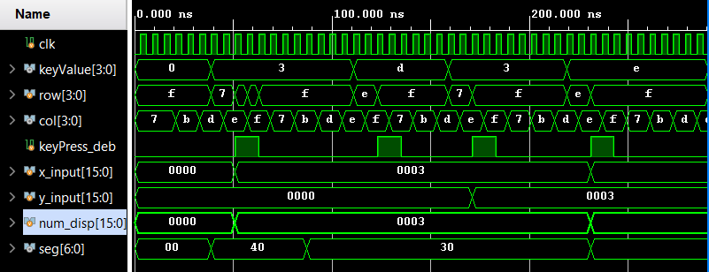
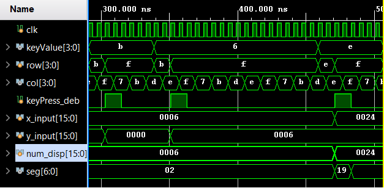
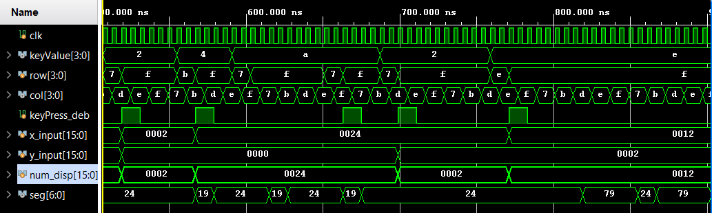
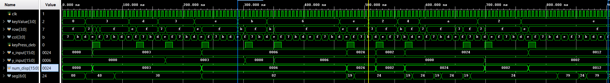

# Basic Calculator
## *An ECEN 340 final project - fall 2021*
A Simple 4 function calculator. The 4 functions included are:
- Divide
- Multiply
- Substract
- Add

With an addition of a clear and an execute button. The project was completed using Vivado 2021.2 in Verilog.

## Simulation Tests
-------------------

*Figure 1 - Keypad inputs of "3 + 3 =" with result shown in "num_disp"*
  

*Figure 2 - Keypad inputs of "* 6 =" with result shown in "num_disp"*
  

*Figure 3 - Keypad inputs of "24 / 2 =" with result shown in "num_disp"*
  

*Figure 4 - Overall of simulation tests*
  

[Learn how to contribute to the project here][contributing_doc]

<!-- LINKS -->
[contributing_doc]: ./doc/contributing.md