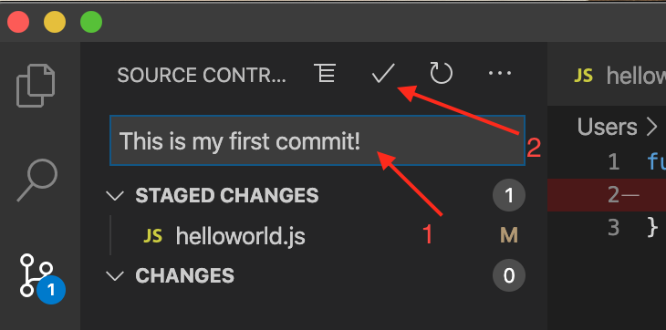
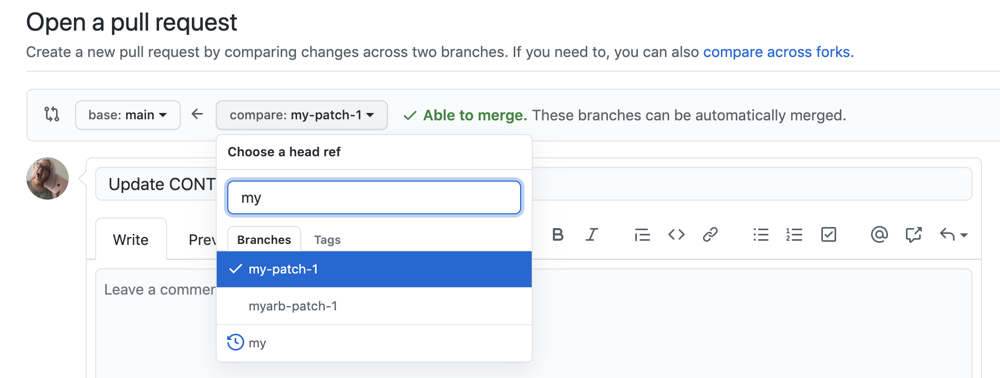

# Basic Calculator
## *An ECEN 340 final project - fall 2021*
Simple 4 function calculator.

## How to send changes to code repository
-----------------------------------------
### **Command line (from project dir)**
1. `git add .`
1. `git commit -m "your commit message in the quotes"`
1. `git pull` (Make sure that there aren't any changes made that you need to bring in to your code)
1. `git push` (after merging changes AND repeating steps 1 and 2)
1. Create Pull Request (PR), and wait for someone to review it
1. Once PR is reviewed, merge your changes into the main code base

### **Using VS Code**
[See full instructions here][git-vs-code-intructions]
1. Make changes in Vivado
1. Go to Git in VS Code\

1. Add any file you want to send at once (clicking the `+`)\

1. Once the file(s) is added, it will look like this\

1. After adding the file(s) with changes, commit them with the checkmark\

1. Send your changes to the repository\

1. Go to GitHub, and create a Pull Request (PR) (under Pull Requests). [See full explanation here][github-pr-instructions]\

1. Make sure you're creating a PR for the right branch to master\

1. Once the PR has been reviewed by one of us, go ahead and merge it\

<!-- LINKS -->
[git-vs-code-intructions]: https://zeroesandones.medium.com/how-to-commit-and-push-your-changes-to-your-github-repository-in-vscode-77a7a3d7dd02
[github-pr-instructions]: https://docs.github.com/en/pull-requests/collaborating-with-pull-requests/proposing-changes-to-your-work-with-pull-requests/creating-a-pull-request